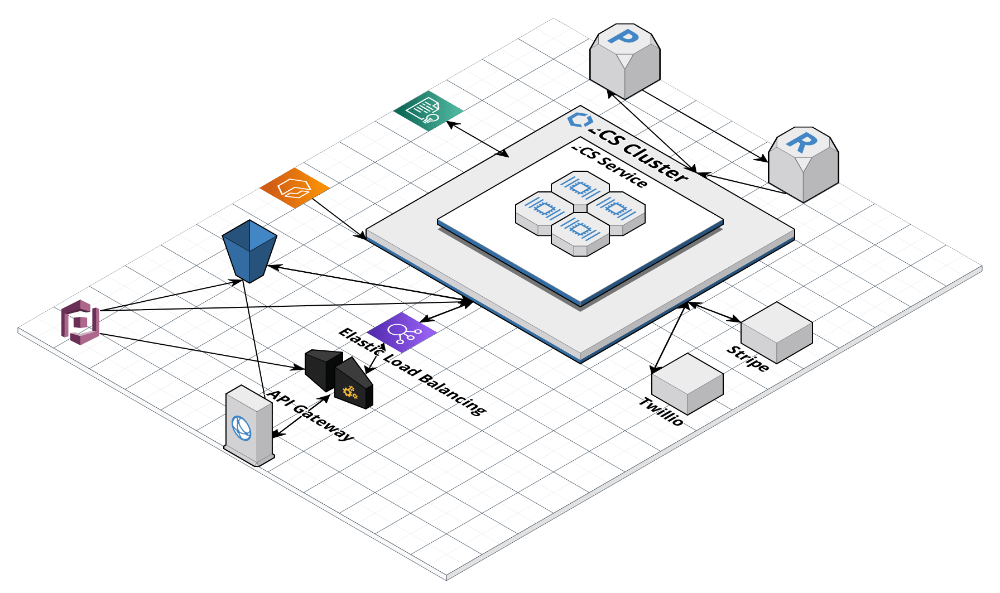
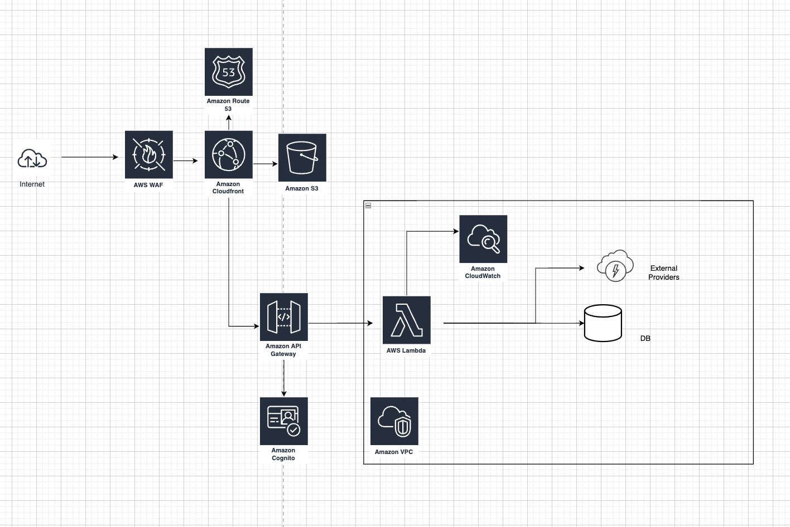
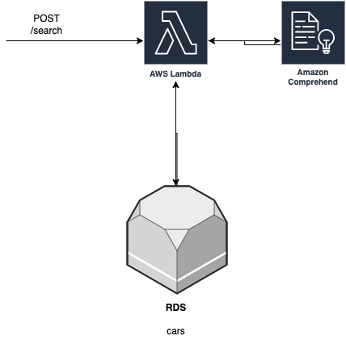
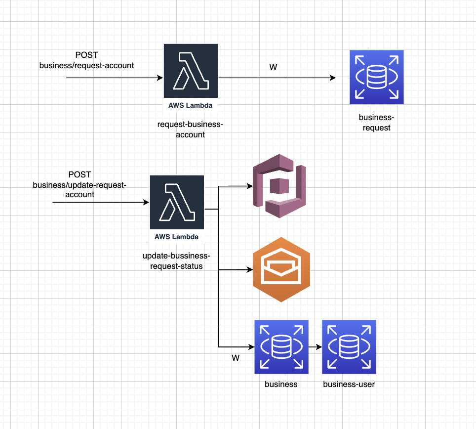
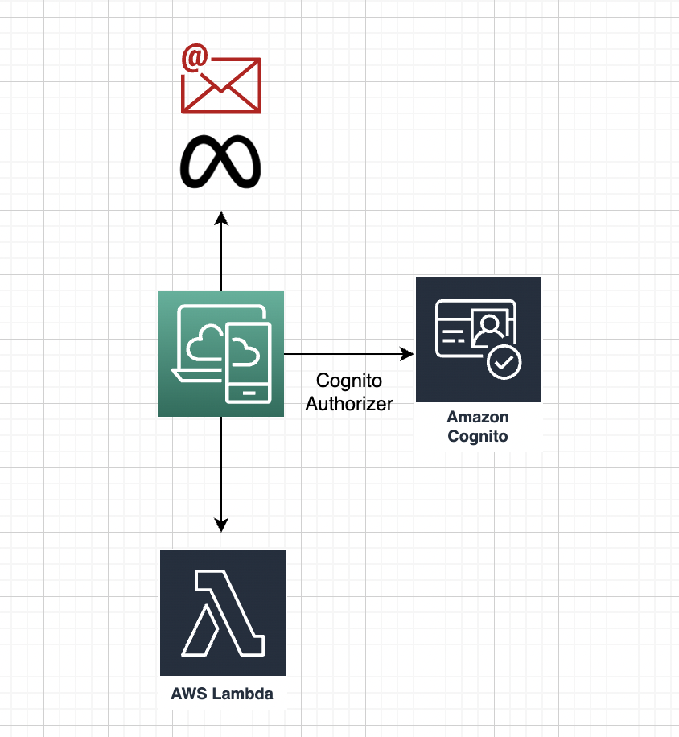
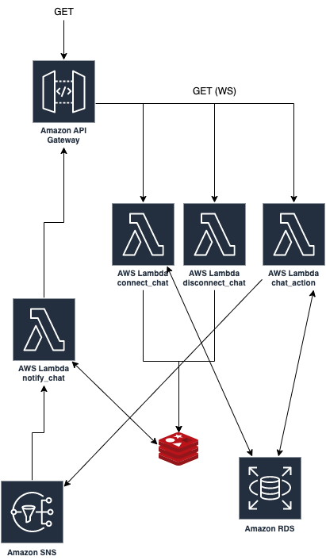

# Architecture

Created: February 27, 2023 4:34 PM
Tags: document

[https://app.cloudcraft.co/view/930d39e6-a3d9-421d-aecf-05c7307facab?key=e6e37a49-c425-4d10-81cc-e2bed02ecad4&interactive=true&embed=true](https://app.cloudcraft.co/view/930d39e6-a3d9-421d-aecf-05c7307facab?key=e6e37a49-c425-4d10-81cc-e2bed02ecad4&interactive=true&embed=true)

[https://app.cloudcraft.co/view/930d39e6-a3d9-421d-aecf-05c7307facab?key=e6e37a49-c425-4d10-81cc-e2bed02ecad4&interactive=true&embed=true](https://app.cloudcraft.co/view/930d39e6-a3d9-421d-aecf-05c7307facab?key=e6e37a49-c425-4d10-81cc-e2bed02ecad4&interactive=true&embed=true)

**General Architecture**

### Search Subsystem

**Business** **Account Creation Subsystem:**

**Customer Login:**

### Communication Subsystem

